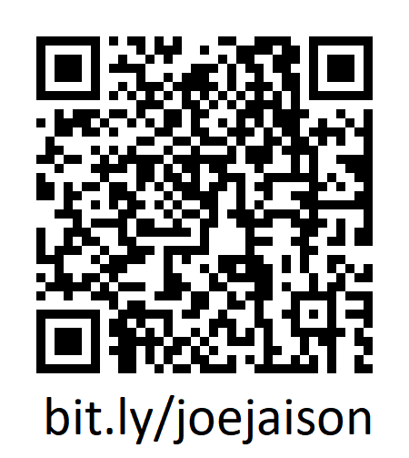

# Forever-Useless

## because the page is still under construction

# Portfolio Website

Welcome to my portfolio! This repository hosts the source code for my personal website, showcasing my projects, skills, and experiences. Explore my work and connect with me!

## 🚀 Getting Started

### To run this website locally:

1. Clone this repository:

   ```bash
   git clone https://github.com/Forever-Uselesss/forever-uselesss.github.io
   ```

   go to cloned directory.

   ```bash
   cd forever-uselesss.github.io
   ```

   <br>

2. Start python server:

   🐧 Linux:

   ```bash
   python3 start_server.py
   ```

   Windows:

   ```bash
   python start_server.py
   ```

   <br>

3. Open Browser and type in:
   ```bash
   localhost:8080
   ```
   <br>

### To access this website on the web

1. Click on the link below or copy paste in your browser

&nbsp;&nbsp;&nbsp;&nbsp;https://forever-uselesss.github.io/

2. Acess through a QR Code
   
&nbsp;&nbsp;&nbsp;&nbsp;<a href="https://forever-uselesss.github.io/" target="_blank" rel="noopener noreferrer"></a>
<br>

# 📧 Contact

Feel free to reach out to me for any questions, feedback, or collaboration opportunities!

<links>
<!-- LinkedIn --><a href="https://www.linkedin.com/in/joe-jaison-t" target="_blank" rel="noopener noreferrer"></a><!-- Email gmail --> <a href="mailto:joejaisonth@gmail.com"></a><!-- GitHub --> <a href="https://github.com/Forever-Uselesss" target="_blank" rel="noopener noreferrer"></a>
</links>
